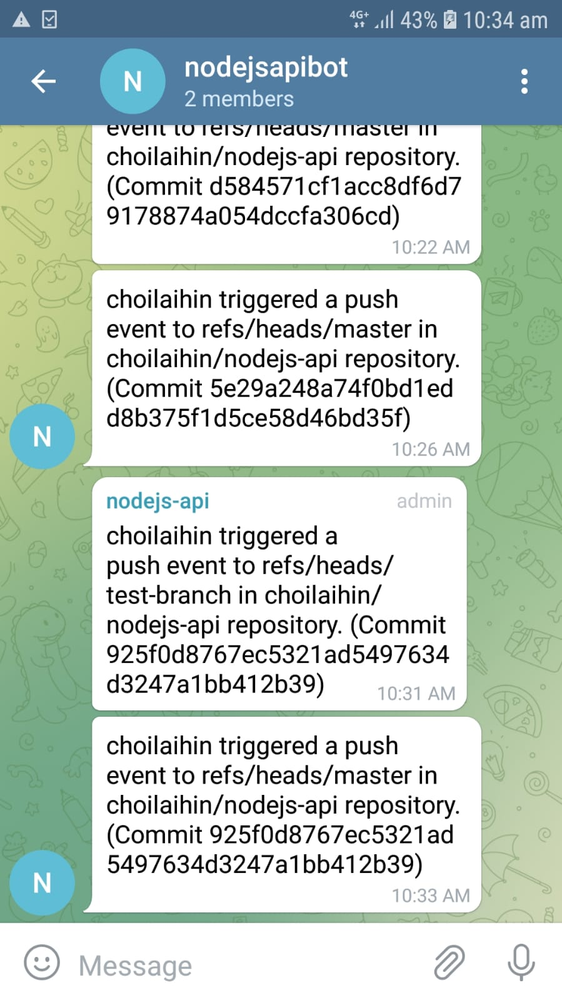

# Lottery Number Generator API – NodeJS

CI/CD pipeline implemented using GitHub Actions:

1. Telegram Notification (telegram-message):

- Send a Telegram message to nodejsapibot private group about the event, join the Telegram group via [https://t.me/joinchat/bwibE9jnGpNmNjZl](https://t.me/joinchat/bwibE9jnGpNmNjZl)
- Create a new Telegram bot to obtain a bot token: [https://core.telegram.org/bots#6-botfather](https://core.telegram.org/bots#6-botfather)
- Create a private group on Telegram, add the above bot to the group, and then obtain the chat ID: [https://github.com/GabrielRF/telegram-id#web-channel-id](https://github.com/GabrielRF/telegram-id#web-channel-id)
- Use the workflow by appleboy: [https://github.com/appleboy/telegram-action.git](https://github.com/appleboy/telegram-action.git)

This shows the Telegram notification received when a push/pull request is triggered:  

2. Setup, Build, Publish, and Deploy (cloudrun-deploy):

- Setup Google Cloud command-line tool (CLI)
- Create docker container
- Push to gcr.io container registry
- Deploy to Google Cloud Run

Live endpoint available at: [https://app-6k5xfijbqq-uc.a.run.app/](https://app-6k5xfijbqq-uc.a.run.app/)

TOTO generator: [https://app-6k5xfijbqq-uc.a.run.app/toto](https://app-6k5xfijbqq-uc.a.run.app/toto)

4D generator: [https://app-6k5xfijbqq-uc.a.run.app/4d](https://app-6k5xfijbqq-uc.a.run.app/4d)
